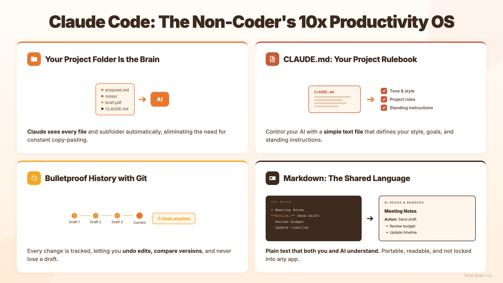
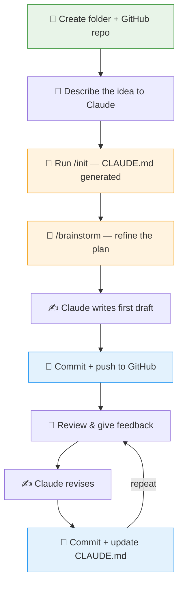

<p align="center">
  
</p>

<h1 align="center">How Non-Technical Knowledge Workers Can Use Claude Code to Actually Manage Their Projects</h1>

<p align="center">
  <a href="README.zh-CN.md"></a>
  <a href="LICENSE"></a>
  
  <br>
  <a href="https://tongshan4869.github.io/"></a>
  <a href="https://github.com/TongShan4869"></a>
  <a href="https://www.linkedin.com/in/tongshan-cu/"></a>
</p>

> *My friend watched me brainstorm ideas, do deep research, read documents and papers, write scripts, summarize a document, and export my progress as a PPTX for a group meeting presentation. All done in Claude Code. She was amazed and asked how I did all of this, like I use Claude Code as my OS now. I admit I've become very AI-native for everything now. But it has genuinely sped up my efficiency by at least 10x. So I figured it made sense to write this for those who are reluctant to use Claude Code beyond coding.*

---

## 1. You're Already Halfway There

You already use AI. Chatbots, maybe Claude's Projects or Cowork, maybe ChatGPT or even OpenClaw. You've gotten comfortable asking it questions, drafting emails, summarizing documents. These tools are genuinely capable.

So why would you want something else? Because there's a difference between a tool that completes tasks for you and a system that manages your work over time. Claude Code is the latter. The name has "code" in it, which scares people off, but Claude Code can do far more than write software. It manages documents, organizes projects, tracks changes, brainstorms ideas, drafts reports, and builds workflows. It just happens to run in a terminal, from ideation and creation to deliverables.

---

## 2. The Full Version

Claude Desktop's Projects gives you memory and context on Anthropic's servers. Cowork adds local file access and autonomous task execution through a friendly interface. Both are good tools. But both are doing specific jobs within constraints you don't control: the interface, the storage, the workflow, the level of customization.

Claude Code gives you the full system. Your local machine has no upload limits, no format restrictions, no imposed structure. A folder on your computer can hold anything: documents, scripts, PDFs / images, entire archives of project history. You organize it however makes sense to you. You control the naming, the hierarchy, the rules.

It's four things that neither Projects nor Cowork can give you:

**Version control.** Every change tracked. Every draft preserved. The ability to undo anything, compare any two points in time, see exactly when a decision was made and what the document looked like before. You can do this through git (more on that later) or with built-in commands like `/rewind` that let you step back through your session history. Nothing is ever lost.

**Deep customization.** Claude Code has an entire ecosystem: Skills that teach Claude specialized workflows, plugins that add bundles of new capabilities, hooks that automate triggers, MCP servers that connect Claude to your email, calendar, Slack, and more. You shape how the agent works, totally customized to your work style, not just what you ask it to do.

**Extensibility.** Cowork can only do what Anthropic has built into it. If a feature doesn't exist yet, you wait. With Claude Code, you describe what you need and Claude builds it for you. A custom tool, a new workflow, an automation, right there in your session. You're not limited to someone else's product roadmap.

**Ownership.** Everything lives on your machine in plain files. Your project folder is the single source of truth, a git repo you can share, back up, or move anywhere. If you stop using Claude Code tomorrow, everything is still there.

---

## 3. Four Things That Make the Difference

There are four ingredients that turn an AI chatbot into something closer to an actual collaborator. None of them require technical expertise.



### Project Folder as Context

When Claude Code runs inside your project folder, it can see everything in it. Every file, every document, every subfolder, always available without you pasting anything. Instead of handing it a snippet and hoping that's the right snippet, it reads the whole picture. This changes what you can ask it to do.

### Project Instructions (CLAUDE.md)

Chatbot apps have basic memory. They can recall things across conversations, and Claude Code has that too. But it goes further with a file called `CLAUDE.md` that you write inside your project folder. It's your rulebook: what this project is about, how you prefer things written, what to avoid, what to always keep in mind. Claude reads it at the start of every session. Unlike memory, which Claude manages on its own, this is precise, project-specific, and entirely under your control. You write the rules. Claude follows them. Want to see what one looks like? Here's [this project's CLAUDE.md](CLAUDE.md).

### Markdown

Markdown is a simple way of writing that tells any program how to format your text (headings, bold, lists) using plain characters you can type anywhere. It's readable as-is, renders beautifully in almost every tool, and doesn't lock you into any single application. Your documents aren't trapped in a proprietary format that only one company's software can open. They're just text files. Permanent, portable, and understood by both humans and AI equally well.

In Claude Code, everything that shapes how the AI works (your project instructions, its memory, its skills, its rules) is written in markdown. It's become the standard format for building and configuring AI agents. Learning markdown isn't just about formatting documents anymore. Markdown is the language you and your AI both speak.

New to Markdown? These resources will get you up to speed quickly:

- [Markdown Guide](https://www.markdownguide.org/) — a comprehensive, beginner-friendly reference. Start with the [Getting Started](https://www.markdownguide.org/getting-started/) page and [Basic Syntax](https://www.markdownguide.org/basic-syntax/) cheat sheet.
- [CommonMark Tutorial](https://commonmark.org/help/tutorial/) — an interactive 10-minute tutorial where you practice as you learn.
- [GitHub's Markdown Documentation](https://docs.github.com/en/get-started/writing-on-github/getting-started-with-writing-and-formatting-on-github/basic-writing-and-formatting-syntax) — covers the GitHub-flavored extensions (tables, task lists, alerts) that you'll encounter in Claude Code projects.

### Git (Version Control)

Git is a system that tracks every change made to a set of files. Developers use it for code, but it works just as well for text-based documents, notes, and project files. Every change is recorded. You can undo anything. You can see exactly what changed, when, and why. That kind of safety net means you can make bold edits without anxiety, because nothing is ever truly gone. Pair it with GitHub (a free online platform) and you have a remote backup of your entire project history, accessible from anywhere, shareable with collaborators, and synced with a single command.

---

> [!NOTE]
> All of these tools (Desktop, Cowork, Claude Code) run on the same model. The difference isn't intelligence; it's the relationship. Desktop is a conversation. Cowork is a task runner. Claude Code is a workspace. It lives inside your project, sees everything, remembers across sessions, and operates within a system you control. The question isn't which is better; it's what you need.

---

## 4. The Mental Model

Here's the conceptual framework for Claude Code. You don't need all of these on day one. But knowing they exist means you'll recognize when one solves a problem you're having.

### Agent

Claude Code doesn't just answer questions. It takes actions. It reads files, creates documents, searches your project, and handles multi-step tasks start to finish. You describe what you want; it figures out the steps. When the job is big enough, it spins up sub-agents that work different parts in parallel.

### Context Management

Claude Code has a large conversation window and automatically compresses earlier parts as you go, so sessions can run long without starting over. It reads your files on demand — your whole project is accessible without pasting anything in.

### Memory

Claude Code persists information across conversations: your preferences, project context, past decisions. You stop repeating yourself every session. Over time, it learns how you work.

### CLAUDE.md

A file you write inside your project folder that tells Claude how to behave in that specific project. Standing instructions, like onboarding a new team member. Claude reads it at the start of every session, so your rules are always in effect.

### Skills

Pre-written instructions that teach Claude specific abilities: a particular workflow, a domain, a kind of task. Install a skill, and Claude gains that capability. Different projects can have different skills loaded.

### MCP Servers

Bridges that connect Claude to external services like Gmail, Google Calendar, Notion, Slack, and others. Once connected, Claude can read emails, check your calendar, or update a Notion page as part of a larger task, without you switching apps.

### Hooks

Automated triggers that run whenever Claude takes a certain action. "When Claude does X, also do Y." Like email filters, they run silently in the background, enforcing consistency without you lifting a finger. For example, I have a hook that plays a sound whenever Claude finishes a long task, so I don't have to keep watching the screen.

### Plugins

Bundles of skills, commands, and tools packaged into a single installable unit, combining several of the above into one package. Think of them like apps on your phone: each one adds a coherent set of abilities.

---

## 5. Getting Started

This walkthrough teaches the pattern. You bring your own content — your documents, your projects, your questions. The goal is to show you how the pieces fit together so you can apply them to whatever you're actually working on.

---

### 5.1 Install Claude Code

The only slightly technical step. Claude Code runs in your terminal, the text-based command window built into every Mac and Windows computer. You'll also need Node.js (a free software runtime that Claude Code depends on) installed.

The official setup instructions are here: https://docs.anthropic.com/en/docs/claude-code/overview

That page walks you through everything. Don't try to skip steps. Once installation is done, the rest of this guide is straightforward.

**Not comfortable with the terminal?** Claude Code also comes as a [desktop app](https://claude.ai/download) (Mac and Windows) and a [web app](https://claude.ai/code) you can use right in your browser. Both give you the same capabilities without needing to open a terminal yourself. The desktop app is the easiest starting point if the command line feels unfamiliar.

If you prefer to see and edit your files visually rather than working entirely in the terminal, consider using an IDE like VS Code. It lets you edit documents with a live markdown preview, manage your project folder, and run Claude Code in the built-in terminal, all in one window.


---

### 5.2 Create Your Project Folder

Create a folder on your computer for the project you want to work on. This can be anything: a research project, a set of meeting notes, a collection of drafts, a client folder. The name doesn't matter. The principle does: everything related to one project lives in one folder.

This is the unit Claude Code works with. When you open Claude Code pointed at this folder, it can see everything inside it. Files, subfolders, all of it — immediately available, without you pasting a single thing.

Start simple. One folder. Put some files in it. You can organize further later.

---

### 5.3 Start Claude Code

Open your terminal, navigate to your project folder, and type:

```
claude
```

That's it. Claude Code opens inside your folder. It can now see everything in it.


This is the shift. You're not visiting a chatbot and pasting in context. Claude is already sitting in your project. When you ask it something, it can look at the actual files. You stop being the bridge between your work and the AI — the AI has direct access.

---

### 5.4 Start Working

Talk to it the way you'd talk to a capable colleague who just got access to your files. Some examples of things you might actually say:

- "Summarize everything in this folder"
- "Create a meeting notes template I can reuse"
- "What did I write last week about the Henderson proposal?"
- "Draft a response to this email based on the project brief in the brief.md file"
- "What are the open questions across all my notes?"

You don't need special syntax. You don't need to think like a programmer. The conversation is the same as chatting with Claude Desktop — the difference is that Claude now has your actual files in front of it, not just what you chose to paste.

Here's what a real exchange looks like. Say you have a folder with a dozen meeting notes from the past month:

> **You:** What are the main action items across all my meeting notes?
>
> **Claude:** I'll read through your meeting notes. *(reads all 12 files)* Here are the open action items I found across your notes:
> - **Henderson proposal:** Sarah needs to send revised budget by Friday (from March 12 meeting)
> - **Q2 planning:** You committed to drafting the timeline, not yet done (from March 18 meeting)
> - **Client onboarding:** Waiting on legal review of the new contract template (from March 24 meeting)
> - *(3 more items...)*
>
> **You:** Pull out just the ones assigned to me and put them in a new file called my-action-items.md
>
> **Claude:** Done. I've created `my-action-items.md` with your 4 action items, organized by deadline.

That's it. No copying and pasting between files. No searching through documents yourself. Claude read everything, found what mattered, and created the output you asked for.

If it gets something wrong, correct it. If you want more, ask for more. It's iterative and conversational throughout.

**A note on sessions.** Claude works best with a focused context. The longer a session runs and the more topics you cover, the more cluttered its working memory gets, and the less sharp its responses become. A few habits that help:

- **Start a new session for unrelated tasks.** Type `/clear` to wipe the conversation and start fresh. If you were editing a report and now want to brainstorm a completely different project, don't keep going in the same session. Reset.
- **Compact when a session gets long.** Type `/compact` to compress the conversation history. Claude keeps the key points but sheds the noise. Good for when you've been working on the same task for a while and things start feeling sluggish.
- **One topic per session is a good default.** You wouldn't pile ten different meetings into one phone call. Same principle here.

---

### 5.5 Save Your Progress with Git

Git takes snapshots of your project over time. You don't need to learn any commands. Just tell Claude what you want in plain language. Here's the workflow in practice:

- **Stage**: choose which changes to include in your next snapshot. Say: "stage the changes to my proposal draft" or "stage everything." Think of it as deciding what goes into the envelope before you seal it.
- **Commit**: seal the envelope. This saves a named snapshot. Say: "commit my changes" or "commit with the message 'finished first draft of Q2 report'." Do this whenever you reach a natural stopping point — a finished draft, a reorganized folder, a set of edits you're happy with.
- **Push**: send your snapshots to a remote backup (like GitHub). Say: "push my changes." This is how you sync across machines or keep an offsite copy. Not every commit needs a push. Batch a few, then push when you're ready.
- **Reverse**: undo anything. Say: "undo my last commit," "show me what this file looked like yesterday," or "revert the proposal back to last week's version." Nothing is permanent. Every snapshot is still there, and Claude can retrieve any of them.

The payoff: a complete, searchable history of your project, the ability to undo anything, and a record that syncs across machines. The habit of taking named snapshots before you make big changes is valuable far beyond Claude Code.

For a deeper introduction, see [Git for Document Management](git-for-docs.md).

---

### 5.6 Make It Yours

The quickest way to start: type `/init`. Claude scans your project and generates a `CLAUDE.md` file — a first draft of your project's rulebook. Review what it produces and edit it to fit. You can also create the file yourself from scratch. Either way, write it in plain language. Tell Claude how you work:

- What this project is about
- How you prefer things written (plain language, no jargon, bullet points vs. prose)
- What to avoid
- Anything it should always keep in mind

Claude reads this file at the start of every session. From that point on, your preferences are already in effect. You don't brief it every morning. You don't re-explain your context. It knows.

This is where Claude Code stops being a generic tool and becomes yours. Every project can have its own `CLAUDE.md`. A client folder, a research project, a personal journal — each one can have different instructions, different tone, different rules. The setup is a one-time investment that pays off every session after.

A few tips for keeping it useful over time:

- **Keep it short.** Under 300 lines, ideally closer to 100. The longer it gets, the more Claude skims past things. Every line should earn its place.
- **Be specific, not generic.** "Write in plain language" is useful. "Be helpful and accurate" is not — Claude already tries to do that.
- **Don't repeat what the code already says.** If Claude can figure it out by reading your files, it doesn't need to be in `CLAUDE.md`.
- **Prune regularly.** Rules that reference deleted files or outdated decisions become noise. Review it every few weeks.
- **Use `/init` to get started.** It scans your project and generates a first draft. Always review and refine what it produces — it's a starting point, not a finished product.

---

### 5.7 When Things Go Wrong

Claude is capable, but it's not infallible. Here's how to handle the most common stumbling blocks.

**Claude edited the wrong file or made a bad change.** Type `/undo`. This reverses Claude's last action. You can also say "undo that" or "revert the last change" in plain language. If you've been committing regularly with git, you can go back further: "revert to my last commit."

**Claude seems confused or its responses are getting worse.** Long sessions accumulate context that can muddy things. Type `/clear` to wipe the conversation and start fresh. Your files are untouched; only the conversation resets. For a softer reset, try `/compact` to compress the history without losing it entirely.

**Claude misunderstood what you wanted.** Just correct it, the same way you would with a colleague. "No, I meant the Q2 report, not the Q1 one." or "That's too formal, rewrite it in a casual tone." You don't need to start over. Claude adjusts based on your feedback within the same conversation.

**Claude can't find a file you know exists.** It might be looking in the wrong place. Be specific: "Read the file called proposal-v2.md in the clients folder." You can also say "list all files in this folder" to see what Claude sees.

**You want to see what Claude changed before accepting it.** Say "show me a diff of what you just changed" or "what did you modify?" Claude will show you exactly what lines were added, removed, or edited. If you use git, "show me the diff" gives you a complete picture of all uncommitted changes.

**Something broke and you're not sure what happened.** Don't panic. If you've been using git, everything is recoverable. Say "show me the git log" to see your recent snapshots, then "revert to [that commit]" to go back to a known good state. If you haven't been using git, `/undo` can still step back through Claude's recent actions.

The general principle: if Claude does something you don't like, say so. If the session feels off, start a new one. If you committed your work, you can always get back to it.

---

## 6. How I Built This Guide with Claude Code

I'm a researcher. I both write code and manage documents, projects, and communication. But it was exactly that dual perspective that made me realize Claude Code could be useful far beyond coding. The document and project management side of my work, the part that has nothing to do with programming, benefited from it just as much. That's why I wrote this guide.

This entire guide was built using Claude Code. The thing you're reading right now is the proof of concept. Here's what the process looked like:



**Step 1 — Create the folder and a GitHub repo.** I made a folder called `ClaudeCode_for_non-tech` on my computer and created a matching repository on GitHub. Nothing in it yet — just the empty container.

**Step 2 — Open Claude Code and start talking.** I opened Claude Code inside the empty folder and described what I wanted to build. No outline, no structure — just a conversation about the idea. What's the audience? What's the point? What should it cover? A few rounds of back and forth to get the shape of the project clear.

**Step 3 — `/init` and link to GitHub.** Once Claude understood the project, I ran `/init`. Claude scanned our conversation and generated a `CLAUDE.md` file with the project's purpose, audience, tone, and rules already filled in. I also had Claude link the local folder to the remote GitHub repo so everything would stay in sync.

**Step 4 — Brainstorm with a skill.** This is where it got serious. I used the brainstorming skill (type `/brainstorm` if you have the Superpowers plugin installed). Instead of just writing, Claude asked me questions. Thorough, specific ones that forced me to refine vague ideas into clear decisions. What does the reader already know? What's the core argument? What should come first? I highly recommend using the skill rather than just prompting freehand. It thinks more thoroughly than you'd think to ask for.

**Step 5 — First draft, then commit and push.** Claude wrote the first draft based on everything we'd worked out. Once it was down, I committed and pushed to GitHub, saving the initial version of the repo. Now there's a baseline to build from, and a backup in the cloud.

**Step 6 — Review and revise.** I read through the draft, gave feedback, redirected where needed. Claude revised. This is the iterative part — conversational, back and forth, same as working with a colleague.

**Step 7 — The editing loop: save, commit, update CLAUDE.md.** For each chunk of edits, the cycle repeats: make changes, commit them to git, and update `CLAUDE.md` if the project's rules or direction have shifted. This keeps everything in sync — the document, the history, and the instructions Claude follows. Every round of edits is preserved and the rulebook stays current.

**The thing I kept noticing:** I never had to repeat myself. Claude knew the audience from `CLAUDE.md`, the structure from the plan, the argument from the brainstorm. I wasn't bridging anything — I was just directing.

Every decision is in the git history. Every draft, every revision, every moment I changed course. I can see exactly when I restructured Section 3 and what it looked like before. That would have been impossible to track in a chatbot.

If you want to see what Claude actually produced during the brainstorming and planning phases, the [design spec](docs/superpowers/specs/2026-04-01-claude-code-for-non-tech-design.md) and [implementation plan](docs/superpowers/plans/2026-04-01-claude-code-for-non-tech.md) are both in the `docs/` folder of this repo.

So when I describe the pattern (folder, markdown, git, agent) I'm describing what I did to build what you're reading now. The pattern works. I can confirm it from the inside.

---

## 7. Recommended Tools

These are the additions that made the most difference. You don't need all of them on day one, but each one extends Claude Code in a direction that's genuinely useful for knowledge workers.

**Superpowers plugin** — A collection of skills for structured brainstorming, planning, and execution. This is how this guide was built: Claude brainstormed the design, wrote a spec, created a section-by-section plan, then executed it, committing as it went. Without this, the process would have been much more improvisational and harder to track. With it, Claude has a reliable workflow for any project that starts as an idea and needs to become a document.

**Context7** — Fetches up-to-date documentation for libraries, tools, and services. Useful because AI training data has a cutoff date, so Claude's built-in knowledge of specific software tools and their current versions may be out of date. Context7 gives Claude a way to look things up rather than guess from memory.

**Playwright plugin** — Lets Claude browse the web and interact with websites directly. Useful for research, pulling information from pages, checking references, or gathering source material without you doing it by hand first.

For a deeper guide on what Skills are and how to find more, see [Understanding Skills](skills-guide.md).

---

## 8. Go Explore

The pattern is simple: folder, markdown, git, agent. That's all four ingredients. You don't need to master them before you start — you learn them by using them.

What makes it yours is the content. Your projects, your files, your preferences, your `CLAUDE.md`. The same setup that built this guide works equally well for a client folder, a research project, a set of meeting notes, a running archive of decisions and drafts. Apply it to whatever you're actually managing.

The goal is to work with less friction. Stop re-explaining context, stop losing document history, stop being the bridge between your work and your tools. Once you internalize the pattern, you'll start seeing where it fits.

Start with one folder. Write one `CLAUDE.md`. See what happens.
