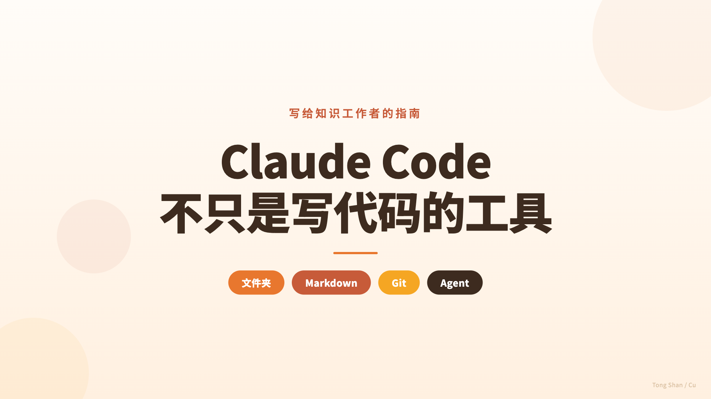
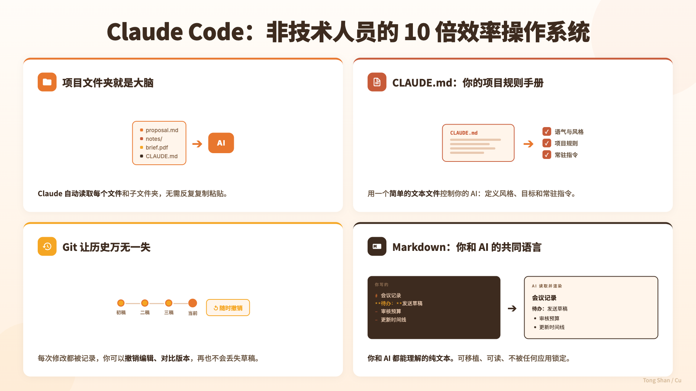
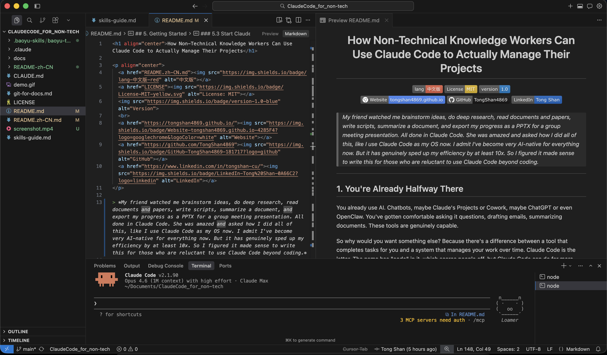
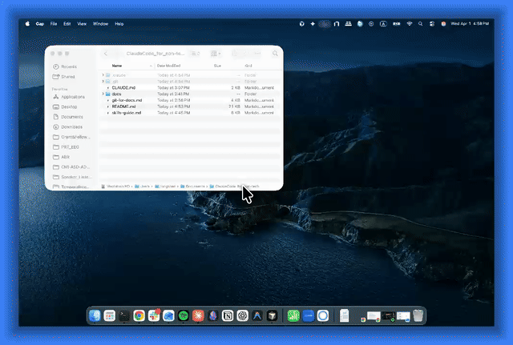
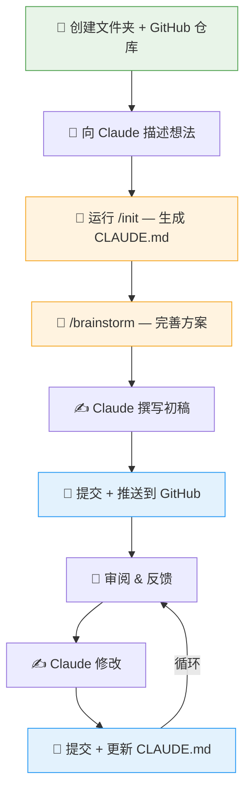

<p align="center">
  
</p>

<h1 align="center">非技术知识工作者如何用 Claude Code 真正管理自己的项目</h1>

<p align="center">
  <a href="README.md"></a>
  <a href="LICENSE"></a>
  
  <br>
  <a href="https://tongshan4869.github.io/"></a>
  <a href="https://github.com/TongShan4869"></a>
  <a href="https://www.linkedin.com/in/tongshan-cu/"></a>
</p>

> *我的同事看着我用 Claude Code 头脑风暴、做深度调研、阅读文档和论文、写脚本、总结文档，还把进度导出成 PPTX 用于组会汇报。全程都在 Claude Code 里完成。她很震惊，问我怎么做到的，说我简直把 Claude Code 当操作系统用了。我承认，我现在做什么都离不开 AI 了。但它确实让我的效率提升了至少 10 倍。所以我觉得有必要写一篇东西，给那些还不太敢把 Claude Code 用在编程以外场景的人看看。*

---

## 1. 其实，你已经在路上了

你已经在用 AI 了。聊天机器人，也许是 Claude 的 Projects 或 Cowork（均为 Claude Desktop 的功能），也许是 ChatGPT。你已经习惯了让它回答问题、起草邮件、总结文档。这些工具确实很能干。

那为什么还要换别的？因为"帮你完成任务的工具"和"帮你长期管理工作的系统"之间，有本质的区别。Claude Code 属于后者。名字里带个"Code"，听起来像是给程序员用的，很多人一看名字就跳过了。但 Claude Code 的能力远不止写代码。它能管理文档、组织项目、追踪变更、头脑风暴、起草报告、搭建工作流。只不过它运行在终端（Terminal）里，从构思、创作到交付，全程覆盖。

---

## 2. 真正完整的环境

Claude Desktop 的 Projects 提供了记忆和上下文，数据存储在 Anthropic 的服务器上。Cowork 增加了本地文件访问和自主任务执行的能力，界面也很友好。两个都是好工具。但它们都有你控制不了的限制：界面、存储方式、工作流、可定制的程度。

Claude Code 给你的是完整系统。你的本地电脑没有上传限制、没有格式限制、没有强加的结构。电脑上的一个文件夹可以装下任何东西：文档、脚本、PDF / 图片、项目历史的完整归档。你想怎么组织就怎么组织。命名、层级、规则，全由你定。

关键在于四样 Projects 和 Cowork 都给不了你的东西：

**版本控制（Version Control）。** 每一处修改都有记录。每一版草稿都有留存。随时可以撤销任何改动，对比任意两个时间点，精确看到某个决策是什么时候做的、改动之前文档长什么样。你可以通过 Git（后面会详细说）来实现，也可以用内置命令 `/rewind` 逐步回溯会话历史。什么都不会丢。

**深度定制。** Claude Code 有一整个生态系统：Skills 能教会 Claude 专项工作流，插件（Plugins）能批量添加新能力，Hooks（自动触发器）能设置自动化触发，MCP 服务器（Model Context Protocol）能把 Claude 连接到你的邮箱、日历、Slack 等等。你可以塑造 AI 的工作方式，完全贴合你的风格，而不只是告诉它做什么。

**可扩展性。** Cowork 只能做 Anthropic 已经内置的功能。某个功能还没出？等着吧。用 Claude Code，你描述你需要什么，Claude 直接帮你搭。自定义工具、新工作流、自动化流程，当场就能实现。你不用受限于别人的产品路线图。

**所有权。** 一切都以普通文件的形式存在你的电脑上。你的项目文件夹就是唯一的信息源头，是一个可以分享、备份、随时搬走的 Git 仓库（repo）。哪天你不用 Claude Code 了，所有东西还在那里。

---

## 3. 真正拉开差距的四样东西

有四样东西，能把 AI 聊天机器人变成接近真正协作者的存在。每一样都不需要技术背景。



### 项目文件夹即上下文

当 Claude Code 在你的项目文件夹里运行时，它能看到里面的一切。每个文件、每份文档、每个子文件夹，随时可用，不需要你粘贴任何东西。你不用再挑一段内容塞给它、然后祈祷挑对了。它直接看到全貌。这从根本上改变了你能让它做的事。

### 项目指令（CLAUDE.md）

聊天应用有基本的记忆功能。它们能跨对话记住一些东西，Claude Code 也有这个能力。但它更进一步：你可以在项目文件夹里写一个叫 `CLAUDE.md` 的文件。这是你的规则手册：这个项目是关于什么的、你喜欢什么写作风格、要避免什么、有什么需要始终牢记的。Claude 在每次会话开始时都会读取它。和 Claude 自己管理的记忆不同，这份文件是精确的、项目专属的、完全由你掌控的。你写规则，Claude 照着执行。想看看实际的例子？这是[本项目的 CLAUDE.md](CLAUDE.md)。

### Markdown

Markdown 是一种简单的写作格式，用普通字符（随便在哪都能打出来）告诉任何程序如何显示你的文本：标题、加粗、列表。它原样就能读，在几乎所有工具里都能漂亮地渲染，而且不把你锁定在任何单一应用中。你的文档不会被困在某个只有特定公司的软件才能打开的私有格式里。它们就是文本文件。永久的、可移植的，人和 AI 都能同样好地理解。

在 Claude Code 里，所有塑造 AI 工作方式的东西（项目指令、记忆、技能、规则）都用 Markdown 写成。它已经成为构建和配置 AI 智能体的标准格式。学 Markdown 不再只是为了排版文档。Markdown 是你和你的 AI 共同的语言。

### Git（版本控制）

Git 是一套追踪文件所有变更的系统。开发者用它管理代码，但它对文本文档、笔记和项目文件同样好用。每一处改动都有记录。任何操作都可以撤销。你能精确看到什么改了、什么时候改的、为什么改。这种安全网意味着你可以大胆编辑而不焦虑，因为没有任何东西会真正消失。搭配 GitHub（一个免费的在线平台），你就有了整个项目历史的远程备份，随时随地可访问、可与协作者共享、一条命令就能同步。

---

> [!NOTE]
> 以上所有工具（Desktop、Cowork、Claude Code）运行的是同一个模型。差别不在智能，而在关系。Desktop 是一场对话。Cowork 是一个任务执行器。Claude Code 是一个工作空间。它住在你的项目里，看得到一切，跨会话记忆，运行在你掌控的系统中。问题不是哪个更好，而是你需要什么。

---

## 4. 心智模型

这是 Claude Code 的概念框架。你不需要第一天就全部掌握。但知道它们的存在，意味着当某个问题出现时，你会认出哪个能帮上忙。

### 智能体

Claude Code 不只是回答问题。它采取行动。它读文件、创建文档、搜索你的项目、从头到尾处理多步骤任务。你描述你想要什么，它来想怎么做。当任务足够大时，它会启动子智能体（Sub-agents），并行推进。

### 上下文管理

Claude Code 有很大的对话窗口，并会随着对话推进自动压缩早期内容，因此长时间的会话不需要从头开始。它按需读取你的文件，整个项目随时可用，不需要你粘贴任何东西。

### 记忆

Claude Code 跨对话保留信息：你的偏好、项目上下文、过去的决策。你不用每次开会话都重复一遍。用得越久，它越了解你的工作方式。

### CLAUDE.md

你在项目文件夹里写的一个文件，告诉 Claude 在这个特定项目中如何行事。常驻指令，就像给新团队成员做入职培训。Claude 每次会话开始都会读取它，所以你的规则始终有效。

### Skills

预写好的指令，教会 Claude 特定能力：某种工作流、某个领域、某类任务。安装一个 Skill，Claude 就获得那项能力。不同项目可以加载不同的 Skills。

### MCP 服务器

连接 Claude 和外部服务的桥梁，比如 Gmail、Google Calendar、Notion、Slack 等。连接之后，Claude 可以读邮件、查日历、更新 Notion 页面，作为一个更大任务的一部分完成，不需要你切换应用。

### Hooks

自动触发器，在 Claude 执行特定操作时自动运行。"当 Claude 做了 X，同时也做 Y。"像邮件过滤器一样，静默运行在后台，维持一致性，不需要你动手。比如我就设了一个 Hook，每当 Claude 完成一个长任务时播放提示音，这样我不用一直盯着屏幕。

### 插件

把 Skills、命令和工具打包成一个可安装的单元，将上面几种能力组合到一起。把它们想象成手机上的 App：每个都添加一组完整的能力。

---

## 5. 开始上手

这个教程教的是模式。你的内容由你自己带，你的文档、你的项目、你的问题。目标是让你看到各个部件怎么拼在一起，然后应用到你真正在做的工作上。

---

### 5.1 安装 Claude Code

唯一稍有技术门槛的步骤。Claude Code 运行在终端里，也就是每台 Mac 和 Windows 电脑都内置的文字命令窗口。你还需要安装 Node.js（一个免费的软件运行环境，Claude Code 依赖它）。

官方安装指南在这里：https://docs.anthropic.com/en/docs/claude-code/overview

那个页面会手把手引导你完成一切。不要试图跳步骤。安装结束后，本指南的其余部分就很顺畅了。

如果你更习惯直观地查看和编辑文件，而不是完全在终端里操作，可以考虑使用 VS Code 这样的 IDE。它可以让你在同一个窗口里编辑文档、实时预览 Markdown 效果，管理项目文件夹，还能在内置终端里运行 Claude Code。



---

### 5.2 创建你的项目文件夹

在你的电脑上为要做的项目创建一个文件夹。可以是任何东西：研究项目、会议纪要合集、一组草稿、一个客户文件夹。名字不重要，原则才重要：一个项目的所有相关内容放在一个文件夹里。

这就是 Claude Code 的工作单元。当你在这个文件夹里打开 Claude Code，它能看到里面所有东西。文件、子文件夹，全部即时可用，不需要你粘贴任何内容。

从简单开始。一个文件夹。放一些文件进去。后面可以再整理。

---

### 5.3 启动 Claude Code

打开终端，导航到你的项目文件夹，输入：

```
claude
```

就这样。Claude Code 在你的文件夹里打开了。它现在能看到里面的一切。



这就是那个转变。你不再是去拜访一个聊天机器人然后把上下文粘贴进去。Claude 已经坐在你的项目里了。当你问它什么，它能直接看到实际的文件。你不用再当你的工作和 AI 之间的传话人了，AI 直接有了访问权限。

---

### 5.4 开始工作

像跟一个刚拿到你所有文件的能干同事说话那样跟它说话。你可能会说的一些话：

- "总结这个文件夹里的所有内容"
- "创建一个我可以复用的会议纪要模板"
- "我上周写的关于 Henderson 提案的东西在哪？"
- "根据 brief.md 文件里的项目简报，帮我起草一封回复邮件"
- "我所有笔记里有哪些未解决的问题？"

不需要特殊语法。不需要像程序员一样思考。对话体验和用 Claude Desktop 聊天一样，区别在于 Claude 现在面前摆着你的实际文件，不再是你选择粘贴的片段。

如果它搞错了，纠正它。如果你想要更多，继续追问。全程都是迭代式、对话式的。

**关于会话的说明。** Claude 在聚焦的上下文中表现最好。会话跑得越长、涉及的话题越多，工作记忆就越杂乱，回复的质量就越下降。几个好习惯：

- **不相关的任务就开新会话。** 输入 `/clear` 清空对话，从头开始。如果你刚在编辑报告，现在想头脑风暴一个完全不同的项目，别在同一个会话里继续。重置。
- **会话变长时做压缩。** 输入 `/compact` 压缩对话历史。Claude 会保留要点但清除噪音。适合在同一个任务上工作了一段时间、感觉反应开始变慢的时候用。
- **一个话题一个会话是好习惯。** 你不会把十个不相关的会议塞进一个电话里。这里也是同样的道理。

---

### 5.5 用 Git 保存你的进度

Git 按时间给你的项目拍快照（snapshot）。你不需要学任何命令。用自然语言告诉 Claude 你想做什么就行。实际的工作流程是这样的：

- **暂存（Stage）**：选择哪些改动要纳入下一个快照。说："暂存我对提案草稿的修改"或"暂存所有东西。"把它想象成决定信封里放什么，在你封口之前。
- **提交（Commit）**：封好信封。这会保存一个有名称的快照。说："提交我的修改"或"提交，备注写'完成 Q2 报告初稿'。"每当你到达一个自然的停顿点时就做一次提交：写完一版草稿、整理完一个文件夹、做完一组你满意的编辑。
- **推送（Push）**：把你的快照发送到远程备份（比如 GitHub）。说："推送我的修改。"这是你跨设备同步或保留异地副本的方式。不是每次提交都需要推送。攒几次再推也行，准备好了再推。
- **回退**：撤销任何东西。说："撤销我上次的提交"，"给我看看这个文件昨天长什么样"，或者"把提案恢复到上周的版本。"没有什么是不可逆的。每个快照都还在那里，Claude 可以找回任何一个。

回报：一份完整的、可搜索的项目历史，随时撤销任何操作的能力，以及跨设备同步的记录。在大改之前拍快照的习惯，其价值远不止 Claude Code 本身。

更深入的介绍请参阅 [Git 文档管理指南](git-for-docs.md)。

---

### 5.6 让它成为你的

最快的起步方式：输入 `/init`。Claude 会扫描你的项目并生成一个 `CLAUDE.md` 文件，你的项目规则手册的第一版草稿。检查它生成的内容，按需修改。你也可以从零开始自己写。不管哪种方式，都用自然语言写。告诉 Claude 你怎么工作：

- 这个项目是关于什么的
- 你偏好的写作方式（平实的语言、不要术语、用要点还是段落）
- 要避免什么
- 有什么它应该始终记住的

Claude 每次会话开始都会读这个文件。从那以后，你的偏好就已经生效了。你不用每天早上跟它重新交代一遍。你不用重新解释上下文。它知道。

这就是 Claude Code 从一个通用工具变成"你的"工具的时刻。每个项目都可以有自己的 `CLAUDE.md`。客户文件夹、研究项目、个人日志，每一个都可以有不同的指令、不同的语气、不同的规则。这是一次性的投入，之后每次会话都会持续回报。

保持它好用的几个建议：

- **保持简短。** 控制在 300 行以内，最好接近 100 行。越长，Claude 越容易跳过一些内容。每一行都应该有存在的价值。
- **具体，不要泛泛。** "用平实的语言写"是有用的。"要有帮助且准确"没用，因为 Claude 本来就会这样做。
- **不要重复文件里已经说了的。** 如果 Claude 读你的文件就能搞清楚的事情，就不需要写进 `CLAUDE.md`。
- **定期清理。** 引用已删除文件或过时决策的规则会变成噪音。每隔几周审查一次。
- **用 `/init` 起步。** 它会扫描你的项目并生成第一版草稿。一定要检查和修改它生成的内容，那是起点，不是成品。

---

## 6. 我是怎么用 Claude Code 写出这篇指南的

我是一名研究人员。我既写代码，也管理文档、项目和沟通。正是这个双重视角让我意识到 Claude Code 的用途远不止写代码。我工作中文档和项目管理的那部分，跟编程毫无关系的那部分，从 Claude Code 中获益同样巨大。所以我写了这篇指南。

这整篇指南就是用 Claude Code 写的。你正在读的这个东西，本身就是最好的证明。流程是这样的：



**第一步：创建文件夹和 GitHub 仓库。** 我在电脑上建了一个叫 `ClaudeCode_for_non-tech` 的文件夹，在 GitHub 上创建了对应的仓库（repo）。里面什么都没有，只是一个空容器。

**第二步：打开 Claude Code，开始聊。** 我在这个空文件夹里打开 Claude Code，描述我想做什么。没有大纲，没有结构，就是一段关于这个想法的对话。谁是读者？要表达什么？应该涵盖哪些内容？来回几轮，把项目的大致形状理清楚。

**第三步：`/init`，然后关联 GitHub。** 当 Claude 理解了这个项目，我运行了 `/init`。Claude 扫描了我们的对话，生成了一份 `CLAUDE.md`，里面已经填好了项目目的、受众、语气和规则。我还让 Claude 把本地文件夹和远程的 GitHub 仓库关联起来，保持同步。

**第四步：用 Skill 做头脑风暴。** 这一步开始变得认真起来。我使用了头脑风暴 Skill（如果你安装了 Superpowers 插件，输入 `/brainstorm` 即可）。Claude 不是直接开写，而是向我提问。细致、具体的问题，逼着我把模糊的想法打磨成清晰的决策。读者已经知道什么？核心论点是什么？什么应该放在最前面？我强烈推荐使用这个 Skill，而不是随手写 prompt。它的思考深度超乎你的预期。

**第五步：初稿，然后提交并推送。** Claude 根据我们讨论出的所有内容写了初稿。写完后，我提交（commit）并推送（push）到 GitHub，保存了仓库的初始版本。现在有了一个基线可以在上面继续建设，云端也有了备份。

**第六步：审阅和修改。** 我通读草稿，给出反馈，必要时调整方向。Claude 修改。这是迭代的部分：对话式的，来回推进，和跟同事合作一样。

**第七步：编辑循环——保存、提交、更新 CLAUDE.md。** 每一轮编辑，循环重复：做修改，提交到 Git，如果项目的规则或方向有变就更新 `CLAUDE.md`。这让一切保持同步：文档本身、修改历史、Claude 遵循的指令。每一轮编辑都有保存，规则手册始终是最新的。

**我反复注意到的一件事：** 我从来不用重复自己。Claude 从 `CLAUDE.md` 知道受众，从方案知道结构，从头脑风暴知道论点。我不需要在任何东西之间搭桥，我只是在指挥。

每一个决策都在 Git 历史里。每一版草稿、每一次修改、每一个我改变方向的时刻。我能精确看到什么时候重组了第三节，改之前长什么样。在聊天机器人里，这种追溯是不可能的。

如果你想看看 Claude 在头脑风暴和规划阶段实际产出了什么，[设计规格](docs/superpowers/specs/2026-04-01-claude-code-for-non-tech-design.md)和[实施方案](docs/superpowers/plans/2026-04-01-claude-code-for-non-tech.md)都在本仓库的 `docs/` 文件夹里。

所以当我描述这个模式（文件夹、Markdown、Git、智能体）时，我描述的就是我为了写出你正在读的东西所做的事。这个模式有效。我从内部确认过。

---

## 7. 推荐工具

这些是对我帮助最大的扩展。你不需要第一天就全装上，但每一个都把 Claude Code 的能力延伸到了对知识工作者真正有用的方向。

**Superpowers 插件** — 一套用于结构化头脑风暴、规划和执行的 Skills 集合。这篇指南就是用它写出来的：Claude 做了设计的头脑风暴、写了规格文档、制定了逐节计划、然后执行，一路提交。没有它，整个过程会即兴得多、也更难追踪。有了它，Claude 对任何"从一个想法开始、需要变成一份文档"的项目都有了可靠的工作流。

**Context7** — 为各种库、工具和服务获取最新的文档。这很实用，因为 AI 的训练数据有截止日期，Claude 对某些软件工具及其当前版本的内置知识可能过时了。Context7 让 Claude 能去查阅，而不是凭记忆猜。

**Playwright 插件** — 让 Claude 直接浏览网页、与网站互动。做调研、从网页抓取信息、核实引用、收集素材都很方便，不用你先手动去做。

更深入的 Skills 介绍和更多发现途径，请参阅 [Skills 指南](skills-guide.md)。

---

## 8. 去探索吧

模式很简单：文件夹、Markdown、Git、智能体。四个要素就这些。你不需要先精通再开始，用着用着就学会了。

让它成为你的，靠的是内容。你的项目、你的文件、你的偏好、你的 `CLAUDE.md`。写出这篇指南的那套配置，同样适用于客户文件夹、研究项目、会议纪要集、决策和草稿的长期归档。把它应用到你正在管理的任何东西上。

目标是减少工作中的摩擦。别再反复解释上下文，别再丢失文档历史，别再充当你的工作和工具之间的传话人。一旦你内化了这个模式，你会开始看到它在哪里适用。

从一个文件夹开始。写一份 `CLAUDE.md`。看看会发生什么。
